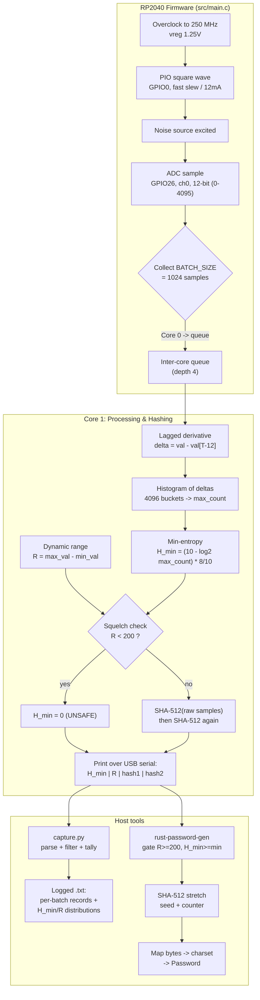

# Entropy Loop — Pipeline & Results

End-to-end flow from analog noise to a usable password, plus distribution
results from capture run `entropy_capture_20260618-103506` (1,539 batches in ~8s).

## Flowchart



## Key parameters

| Parameter | Value | Source |
|-----------|-------|--------|
| System clock | 250 MHz | `TARGET_FREQ_KHZ` |
| ADC resolution | 12-bit (0–4095) | RP2040 SAR ADC |
| Batch size | 1024 samples | `BATCH_SIZE` |
| Lag depth | 12 samples | `LAG_DEPTH` |
| Squelch threshold | R < 200 → unsafe | `dynamic_range < 200` |
| Hash | SHA-512 (×2) | mbedTLS |
| Output per kept batch | 512 bits | 64-byte hash |

## Results — run `2026-06-18 10:35:06` (~8s, 1,539 batches)

- **Throughput:** 1,539 batches in 8.27s ≈ **186 batches/s** ≈ **95 kbit/s** of post-hash randomness (787,968 bits total).
- **All batches passed the squelch** (0 skipped); R ranged 1089–1184, well above the 200 floor.

### H_min distribution (8-bit scaled)

| H_min | count | percent |
|------:|------:|--------:|
| 5.2325 | 2 | 0.13% |
| 5.3425 | 10 | 0.65% |
| 5.4641 | 56 | 3.64% |
| 5.6000 | 143 | 9.29% |
| 5.7541 | 428 | 27.81% |
| **5.9320** | **667** | **43.34%** ◀ mode |
| 6.1425 | 231 | 15.01% |
| 6.4000 | 2 | 0.13% |

Roughly bell-shaped, centered at **~5.93 bits/byte** of min-entropy. The tail
reaches 6.4 but only twice — the realistic per-byte min-entropy floor for this
hardware is ~5.2–6.1 bits.

### R (dynamic range) distribution

| Stat | Value |
|------|-------|
| Min | 1089 |
| Max | 1184 |
| Mean | 1135.5 |
| Mode | 1135 (45 batches) |
| Distinct values | 86 |

R clusters tightly around 1135 out of a possible 4095 — the ADC is swinging
across ~28% of its 12-bit range, comfortably clear of the squelch threshold.

## Takeaways

1. The conditioning (SHA-512) is doing the heavy lifting: raw min-entropy is
   ~5.9 bits/byte, so each 1024-sample batch (~6,070 bits of raw min-entropy)
   is compressed into a 512-bit full-entropy output — a healthy ~12× safety margin.
2. Distributions are stable and unimodal, with no squelch trips, indicating the
   noise source was well-coupled and not floating during the run.

---

# Randomness Test Pipeline (pre- vs post-hash)

To compare the raw analog source against the SHA-512-conditioned output, the
firmware now also emits the **exact bytes that were hashed**, and the host side
runs both **NIST STS 2.1.2** and **dieharder** on each stream.

```
firmware (src/main.c)  — per batch over USB serial:
     H_min: .. | R: .. | Data:
     <128 hex>            SHA-512 of raw samples   (post-hash output)
     <128 hex>            SHA-512 of that hash     (derived)
     RAW: <4096 hex>      the exact bytes hashed   (pre-hash input)   <-- NEW
        |
        v
python-scripts/capture.py --raw-mb 10
     entropy_capture_<ts>.txt    human-readable log (format unchanged)
     entropy_raw_<ts>.json       { post-hash hex : pre-hash raw hex }
        |
        v
tests/extract_streams.py entropy_raw_<ts>.json
     post.bin   all SHA-512 outputs concatenated   (post-hash / conditioned)
     pre.bin    all raw ADC inputs concatenated     (pre-hash / source)
        |
        v
tests/run_analysis.sh pre.bin    -> NIST STS + dieharder reports
tests/run_analysis.sh post.bin   -> NIST STS + dieharder reports
```

## Steps

```bash
# 1. Build & flash (RAW line is added by src/main.c)
cmake --build build -j4                 # -> build/entropy_gen.uf2  (BOOTSEL + copy)

# 2. Capture ~10 MB of raw bits
python3 python-scripts/capture.py --port /dev/tty.usbmodem3101 --raw-mb 10

# 3. Split the JSON map into binary streams
python3 tests/extract_streams.py entropy_raw_<ts>.json --outdir tests/streams

# 4. Run both suites on each side of the hash
tests/run_analysis.sh tests/streams/pre.bin
tests/run_analysis.sh tests/streams/post.bin
```

Each run writes to `tests/results/<name>/`:
- `nist_finalAnalysisReport.txt` — NIST STS table (same format as the repo's
  `2026…finalAnalysisReport…txt`).
- `dieharder.txt` — full dieharder `-a` battery.
- `summary.txt` — quick pass/fail tally.

NIST stream sizing is automatic: `min(1,000,000, total_bits)` per stream, up to
200 streams. Because each batch yields 64 post-hash bytes but 2048 pre-hash
bytes, `pre.bin` is ~32× larger than `post.bin`, so the two get different stream
counts (reported in each run).

## Tooling

Built locally under `tests/tools/` (git-ignored):

- **NIST STS 2.1.2** — official NIST source, `make` → `…/sts-2.1.2/assess`,
  driven non-interactively by `run_analysis.sh`.
- **dieharder 3.31.1** — built from source against Homebrew `gsl`, installed to
  `tests/tools/dieharder-install/`.

Rebuild from scratch:

```bash
brew install gsl autoconf automake libtool

# NIST STS
cd tests/tools && curl -L -o sts.zip \
  https://csrc.nist.gov/CSRC/media/Projects/Random-Bit-Generation/documents/sts-2_1_2.zip
unzip -q sts.zip && cd sts-2.1.2/sts-2.1.2 && make

# dieharder
cd tests/tools && git clone --depth 1 https://github.com/eddelbuettel/dieharder.git
cd dieharder && LIBTOOLIZE=glibtoolize autoreconf -i
./configure --prefix="$PWD/../dieharder-install" \
  CPPFLAGS="-I$(gsl-config --prefix)/include" LDFLAGS="-L$(gsl-config --prefix)/lib"
make -j4 && make install
```

## Interpreting the results

- **NIST STS** suits MB-scale samples and is the primary check. With few streams
  the proportion test has little power; the report states the minimum pass rate
  for the sample size actually used.
- **dieharder** wants multi-GB streams. On a small file it *rewinds* and re-reads
  the data, inflating correlations and producing spurious WEAK/FAILED verdicts —
  treat it as indicative until you feed it a much larger sample (or pipe the
  device output straight into dieharder with `-g 200`).
- The pre-hash stream carries **4 forced-zero bits per 12-bit sample** (samples
  are stored in 16-bit words), so raw-source tests will flag that structure
  regardless of entropy quality — that is genuinely what gets hashed. To test the
  analog source rather than the storage format, pack the 12-bit samples first.
